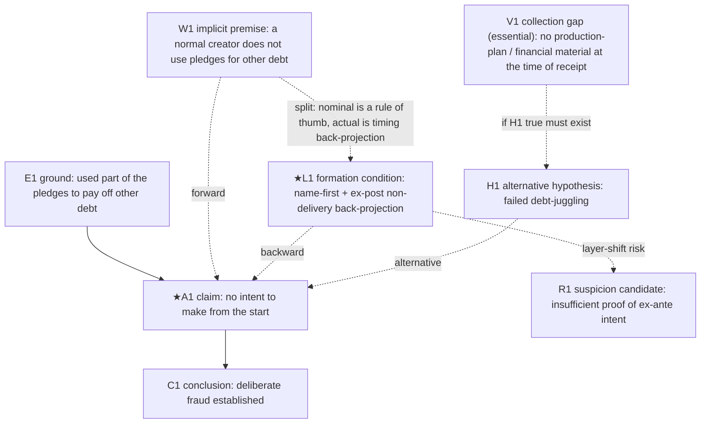

# LARP Worked Example (v260616)

*A reference worked example split out from §17 of the main body "LARP v260616."*
*It shows how the format, depth, vertical blocks, two-pass execution, research queries, and open-questions ledger work together on a single case.*
*The facts below are an illustrative, fictional example, not any specific case. In a real analysis, quote only source text that actually exists in the input material, and do not copy the example sentences verbatim.*

---

## 17. Appendix: Worked example (crowdfunding non-delivery dispute)

This appendix shows the format and depth of an analysis.
The facts below are a fictional, illustrative example, not any specific case. In a real analysis, use only the input material.
The example demonstrates only the core steps in compressed form, and the output follows the vertical-block rule.
It also follows the §3.5 AI execution protocol — it shows two-pass execution, the duty to quote source text, group-number tagging, research-query generation, pre-registration of predictions, and the open-questions ledger together.

### Example input

```text
[Target] An online accusation post claiming "Creator ○○ is a fraud."
[Object now seen] A creator who received 200 million won in pledges and failed to ship the promised product.
[Attached name] Fraudster; intent to embezzle from the start.
[Claim to examine] "The creator embezzled the pledges from the start, with no intent or ability to make the product."
[Currently secured grounds] Pledge deposit records, backer complaints, the non-delivery fact, an indication that the creator used part of the pledges received to pay off other debt.
[Purpose of analysis] Examine the claim / examine the grounds for the accusation.
[Output range] Standard.
```

### Stage-1 excerpt — tracking the current object-perception (5.1·5.4)

```text
#### Object currently seen
- Object now seen: a creator who received pledges and failed to ship the product
- Attached name: a fraudster who planned it from the start
- Current judgment: deceived from the start
- Judgment strength: strong presumption
- Main emotion/preference: backers' anger, the need to punish non-delivery

#### Core formation sentence
This object currently looks like "a fraudster who planned it from the start" because (large sum), (non-delivery), and (use of the received money for other purposes) combine.
The useful joint of this perception is "did the creator have the intent and ability to make the product at the time of receiving the pledges (ex ante)?"
If this joint is confirmed or shaken, the "fraud" judgment changes.

#### Layer-selection joint (stage 1)
- Layer currently relied on: the intent-judgment layer (intent to embezzle)
- Formation condition · evidence · falsifying condition · required action: all present → a living layer
- Does it divide reality vs. overwrite it: divides → proceed to the stage-2 joint (intent to make at the time of pledging)
```

### Stage-2 excerpt — propositionalizing (6)

```text
- Object name: a fraudster who planned it from the start
- Examinable claim: "The creator had no intent or ability to make the product at the time of receiving the pledges."
- Claim type: fact-finding + intent evaluation (mens rea / intent to embezzle)
- Orientation of judgment: reconstructing a past occurrence — using present remaining traces (transaction records, posts) to reconstruct the intent at the time of receipt.
  Caution: do not mix "cannot make it now" (present structure) with "had no intent to make it at the time" (past reconstruction) in one sentence.
- Directly verifiable part: deposit, non-delivery, fund-use records
- Part requiring inference: the subjective intent to make the product at the time of receipt
- Part involving norm/evaluation: whether it can be called "intent to embezzle"
```

### Stage-3 excerpt — minimal reconstruction block (7, candidate 1)

```text
#### Argument candidate 1
- Source quote (illustrative, fictional): "The creator used part of the pledges received to pay off other debt, which supports an intent to embezzle from the start."
- Propositionalized claim: because the money received was used to pay off other debt, there was an intent to embezzle at the time of receipt (strong presumption / past-occurrence reconstruction)
- Claim type: intent evaluation (intent to embezzle)
- Underlying fact or material: transaction records
- Primitive layer of the ground: fact (the transaction record itself) + timing (using ex-post material as a ground for ex-ante intent)
- Connecting premise (warrant): "A normal creator does not use pledges to pay off other debt." (implicit / rule of thumb)
  · Necessity: passes — deny this premise and the fund use no longer supports an intent to embezzle
  · Non-triviality: passes — a general proposition whose truth can be asked outside this case
  · Minimal strength: assigned as a probabilistic proposition. But since the conclusion is "established" (certain), a probabilistic premise does not reach that strength → signal on Q3
- Backward reconstruction: name-first ("fraudster" precedes the reading of the fund use) + timing back-projection (from ex-post non-delivery to ex-ante intent) + the pressure of backers' anger
  · Rival note (★): a rival position (failed debt-juggling) would assign the same transaction records to the practice/action layer (a response to a cash crunch), and would have additionally sought material on the financial state and production plan at the time of receipt
- Contrast (the split): split — the nominal premise is a rule of thumb (a generalization), but the actually operating condition is timing back-projection + name-first. Layer: implicit premise.
- Competing hypothesis: there was intent to make it, but debt-juggling failed amid a cash crunch
- Expected evidence (pre-registered):
  · If the embezzlement hypothesis is true: concealment / disappearance / luxury spending right after receipt (essential) / no attempt to produce (strong expectation)
  · If the competing hypothesis is true: traces of a production plan / orders / progress at the time of receipt (essential) / some attempt to produce (strong expectation)
- Six-question verdict: Q0 holds; Q1 present; Q2 unclear (the reference class of the implicit rule of thumb is unconfirmed); Q3 fails (a probabilistic premise for a certain conclusion); Q4 applies (sole use of an ex-post circumstance); Q5 unclear
- Conclusion relevance: high (★)
- Selected: yes (negative/unclear on Q2·Q3·Q4)
- Group tagging: Group 7 leap to intent / Group 7 unclear time order / Group 5 missing reference class / Group 6 untested alternative hypothesis
- Reason for selection: debt-juggling is compatible with the competing hypothesis, so it must be distinguished. Forward–backward split confirmed.
```

### Mermaid excerpt (7.6)



### 7.7 excerpt — document-level synthesis

```text
- Warrant concealment: 3 of 3 ★ candidates have implicit connecting premises, all pointing in the "fraud" direction (signal present)
- Emphasis on non-diagnostic evidence: non-delivery and fund use are compatible with both hypotheses yet used as core grounds (signal present)
- Absence of a falsifying condition: a failure to explain is converted into incriminating circumstance — a structure where the conclusion holds whatever explanation appears (signal present)
→ The three signals align in the "fraud" direction: register the suspicion of reverse construction (conclusion-first / frame foreclosure) as a document-level opinion.
  Resolving condition: confirming V1 (production plan / financial state at the time of receipt) — whether the evidence a rival frame would have collected exists.
```

### Open-questions ledger excerpt (§3.5 (7))

```text
#### Open question 1 [unconfirmed / pivot]
- Content: the financial state, fund-use plan, and actual production ability at the time of receipt
- How to confirm (case-record type): from the creator's account transaction records, the destination and amount of withdrawals right after the receipt date,
  whether the repaid debt existed before the pledges were received, and whether prototype/order records existed
- If confirmed: "failed debt-juggling" and "embezzled then disappeared" diverge / If not confirmed: the affirmative proof of intent to embezzle remains a gap

#### Open question 2 [unconfirmed / pivot / public-material type]
- Deep-research query: "Citing sources, present the general indicators (existence of a prototype, transparency of fund use, continuity of communication, etc.)
  that distinguish 'fraud from the start' from 'good-faith production failure' in a creator's non-delivery / diversion of funds in crowdfunding."
```

### Stage-5 excerpt — explaining the anomalous argument (9, candidate 2: failure to explain → intent to embezzle)

```text
- The document's or user's logic: the accusation post judges that the creator has an intent to embezzle on the ground that the creator "failed to explain the absence of production ability."
- The missing link: but even if the failure to explain is true, for intent to embezzle to be established, affirmative material that "there was no intent or ability to make the product at the time of receipt" must additionally be confirmed.
- Why it is dangerous: if that material is not confirmed, the alternative explanation remains — that production failed and shipping became impossible after the fact.
- Plain explanation: the mere fact that the creator cannot explain does not directly yield "deceived from the start." The accusing side must provide grounds.
- Reviewer question: the reviewer must confirm material on the financial state, fund-use plan, and production ability at the time of receipt. (linked to open question 1)
- Related useful joint: the intent and ability to make the product at the time of receipt (ex ante)
- Group tagging: Group 8 shifting the burden of proof, Group 6 unfalsifiable structure
```

### Module-T excerpt — sensitivity / robustness (candidate 2)

```text
- Core joint: the affirmative proof of "no intent or ability to make the product at the time of receipt"
- If this is missing or shaken: the intent-to-embezzle conclusion collapses (everything else is ex-post circumstance)
- Does the conclusion hold: no
- Robustness: weak → make confirming this joint the top priority for further verification
```

### Final-synthesis excerpt — remaining core doubt 1

```text
#### Cause 1: converting a failure to explain into a basis for "fraud" (shifting the burden of proof)

The document's or post's judgment: because the creator cannot explain the absence of production ability, an intent to embezzle is established.
Why doubt remains: the accusing side must affirmatively prove "no intent or ability to make the product at the time of receipt," and the creator's failure to explain cannot substitute for it. A failure to explain is also explained by production failure or lack of material.
Related object-formation condition: the "fraudster" name was back-projected from ex-post non-delivery onto ex-ante intent (backward reconstruction L1).
Related argumentative flaw: shifting the burden of proof, unfalsifiable structure, leap to intent, forward–backward split.
What further confirmation is needed to resolve it: objective material on the financial state, production plan, and production ability at the time of receipt (open question 1).
```

#### Inter-cause relationship (Module P)

```text
The causes (shifting the burden of proof, insufficient ruling-out of alternatives, base-rate leap) all
derive from one common flaw — "back-projecting ex-ante intent to embezzle from ex-post non-delivery."
Because they are not independent corroborations but redundancies from the same source, even when synthesized the remaining doubt
concentrates on a single point: "intent and ability to make the product at the time of receipt."
This points to the same place as the 7.7 document-level opinion (suspicion of reverse construction).
```

> Note: if the analyzed target is a document related to establishing a crime, such as a criminal case, write the §13 final assessment report on whether reasonable doubt is resolved, instead of the "final synthesis" above.

> This example shows how the minimal reconstruction block (forward · backward · contrast · competing · six questions), group tagging, pre-registration of predictions, the V node, the 3-signal synthesis, the open-questions ledger, and Modules P · T work together on a single case under the §3.5 protocol (two-pass execution).
> In a real analysis, quote only source text that actually exists in the input material, and do not copy the example sentences verbatim.
