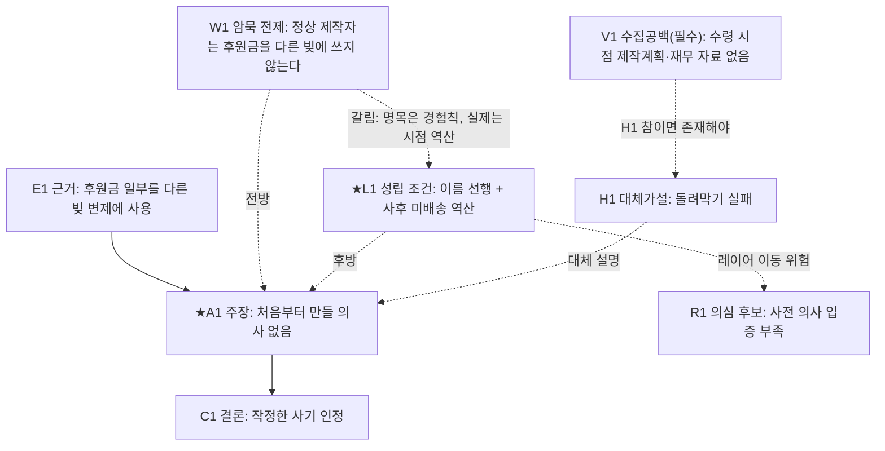

# LARP 워크드 예시 (v260616)

*본문 「LARP v260616」 §17에서 분리된 참고용 워크드 예시다.*
*분석의 형식·깊이·세로형 블록·2단계 실행·리서치 질의·의문점 장부가 한 사건에서 어떻게 함께 작동하는지 보여준다.*
*아래 사실관계는 설명용 가상 예시이며 특정 사건이 아니다. 실제 분석에서는 입력된 자료에 실제로 존재하는 원문만 인용하고, 예시 문장을 그대로 복사하지 말라.*

\---

## 17\. 부록: 워크드 예시 (크라우드펀딩 미배송 논란)

이 부록은 분석의 형식과 깊이를 보여주는 참고 예시다.
아래 사실관계는 설명을 위한 가상의 예시이며 특정 사건이 아니다. 실제 분석에서는 입력된 자료만 사용하라.
예시는 핵심 단계만 압축해 시연하며, 출력은 세로형 블록 규칙을 따른다.
또한 §3.5 AI 실행 프로토콜을 따른다 — 2단계 실행, 원문 인용 의무, 군 번호 태깅, 리서치 질의 생성, 예측 선등록, 의문점 장부를 함께 보여준다.

### 예시 입력

```text
\[분석 대상] "○○ 제작자는 사기다"라고 주장하는 온라인 고발 글
\[지금 보이는 대상] 후원금 2억 원을 받고 약속한 제품을 배송하지 못한 제작자
\[붙은 이름] 사기꾼, 처음부터 작정한 가로챌 의사
\[검토할 주장] "제작자는 처음부터 만들 의사·능력 없이 후원금을 가로챘다"
\[현재 확보된 근거] 후원금 입금 내역, 후원자 항의, 미배송 사실, 제작자가 받은 후원금 중 일부를 다른 빚 변제에 사용한 정황
\[분석 목적] 주장 검토 / 비난의 근거 검토
\[출력 범위] 표준형
```

### 1단계 발췌 — 현재 대상 인식 (5.1·5.4)

```text
#### 현재 보이는 대상
- 지금 보이는 대상: 후원금을 받고 제품을 배송하지 못한 제작자
- 붙은 이름: 처음부터 작정한 사기꾼
- 현재 판단: 처음부터 속였다
- 판단 강도: 강한 추정
- 주요 감정·선호: 후원자의 분노, 미배송에 대한 응징 필요

#### 핵심 성립 문장
이 대상은 현재 (큰 금액), (미배송), (받은 돈의 다른 용도 사용)이 결합되어 "처음부터 작정한 사기꾼"으로 보인다.
이 인식의 유용한 마디는 "후원금을 받을 당시(사전)에 만들 의사·능력이 있었는가"이다.
이 마디가 확인되거나 흔들리면 "사기다"라는 판단이 달라진다.

#### 레이어 선택 마디(1단계)
- 현재 기대는 레이어: 의도 판단 레이어(가로챌 의사)
- 성립조건·증거·반증조건·행위요구: 모두 있음 → 살아있는 레이어
- 현실을 가르는가 vs 덮는가: 가름 → 2단계 마디(후원 당시 만들 의사)로 진행
```

### 2단계 발췌 — 명제화 (6)

```text
- 대상 이름: 처음부터 작정한 사기꾼
- 검토 가능한 주장: "제작자는 후원금 수령 당시 만들 의사 또는 능력이 없었다"
- 주장 유형: 사실인정 + 의도 평가(고의·가로챌 의사)
- 판정의 지향: 과거 발생 재구성 — 현재 남은 흔적(거래내역·게시물)으로 수령 당시의 의사를 재구성하는 작업이다.
  주의: "현재 못 만듦"(현재 구조)과 "당시 만들 의사 없음"(과거 재구성)을 한 문장에 섞지 말 것.
- 직접 확인 가능한 부분: 입금·미배송·자금 사용 내역
- 추론이 필요한 부분: 수령 당시의 주관적 만들 의사
- 규범·평가 개입 부분: "가로챌 의사"라고 부를 수 있는지 여부
```

### 3단계 발췌 — 최소 재구성 블록 (7, 후보 1)

```text
#### 논증 후보 1
- 원문 인용(예시용 가상): "제작자는 받은 후원금 중 일부를 다른 빚 변제에 사용하였는바, 이는 처음부터 가로챌 의사를 뒷받침한다."
- 주장 명제화: 받은 돈을 다른 빚 변제에 썼으므로 수령 당시 가로챌 의사가 있었다 (강한 추정 / 과거 발생 재구성)
- 주장 유형: 의도 평가(가로챌 의사)
- 근거사실 또는 자료: 거래내역
- 근거의 원초적 층위: 사실(거래내역 자체) + 시점(사후 자료를 사전 의사의 근거로 사용)
- 연결 전제(warrant): "정상적 제작자는 후원금을 다른 빚 변제에 사용하지 않는다" (암묵 / 경험칙)
  · 필요성: 통과 — 이 전제를 부정하면 자금 사용은 가로챌 의사를 지지하지 못함
  · 비자명성: 통과 — 사건 밖에서 참거짓을 물을 수 있는 일반 명제
  · 최소 강도: 개연 명제로 귀속. 단, 결론이 "인정된다"(확실)이므로 개연 전제로는 강도가 닿지 않음 → ③문 신호
- 후방 재구성: 이름 선행("사기꾼"이 자금 사용 해석에 앞섬) + 시점 역산(사후 미배송에서 사전 의사로) + 후원자 분노의 압력
  · 경합 병기(★): 라이벌 입장(돌려막기 실패)이라면 같은 거래내역을 실천·행동 레이어(자금난 대응 행위)에 배정하고,
    수령 시점 재무상태·제작 계획 자료를 추가로 찾았을 것
- 대조(갈림): 갈림 — 명목 전제는 경험칙(일반화)인데 실제 작동 조건은 시점 역산 + 이름 선행. 층위: 암묵 전제.
- 경쟁가설: 만들 의사는 있었으나 자금난으로 돌려막기에 실패함
- 기대증거(선등록):
  · 가로챔 가설 참이라면: 수령 직후 은닉·잠적·사치성 소비 (필수) / 제작 시도 전무 (강한 기대)
  · 경쟁가설 참이라면: 수령 시점의 제작 계획·발주·진행 흔적 (필수) / 일부 제작 시도 (강한 기대)
- 6문 판정: ⓪성립 ①있음 ②불명(암묵 경험칙의 준거집단 미확인) ③부정(개연 전제로 확실 결론) ④해당(사후 사정의 단독 사용) ⑤불명
- 결론 관련성: 높음 (★)
- 선별 여부: 예 (②③④에서 부정·불명)
- 군 태깅: 군7 고의·의사추론도약 / 군7 시간순서불명확 / 군5 준거집단부재 / 군6 대체가설미검토
- 선별 이유: 자금 돌려막기는 경쟁가설과 양립하므로 구별 필요. 전방·후방 갈림 확인.
```

### Mermaid 발췌 (7.6)



### 7.7 발췌 — 문서 수준 종합

```text
- 영장 은폐: ★ 후보 3개 중 3개의 연결 전제가 암묵이며, 모두 "사기" 방향 (신호 있음)
- 비진단적 증거 강조: 미배송·자금 사용은 두 가설 모두와 양립하는데 핵심 근거로 사용 (신호 있음)
- 반증 조건 부재: 해명 부재를 사기 정황으로 전환 — 어떤 해명이 나와도 결론 유지 가능한 구조 (신호 있음)
→ 세 신호가 "사기" 방향으로 일치: 역방향 구성(결론선재·프레임선결) 의심을 문서 수준 소견으로 등록.
  해소 조건: V1(수령 시점 제작계획·재무상태)의 확인 — 라이벌 프레임이 수집했을 증거의 존재 여부.
```

### 의문점 장부 발췌 (§3.5 7))

```text
#### 의문점 1 \[미확인 / 피벗]
- 내용: 수령 시점의 재무상태·자금 사용계획·실제 제작 능력
- 확인 방법(사건기록형): 제작자 계좌 거래내역에서 수령일 직후 출금처·금액,
  변제된 빚이 후원금 수령 이전부터 존재했는지, 시제품·발주 기록이 있었는지 확인
- 확인되면: '돌려막기 실패'와 '가로챈 후 잠적'이 갈림 / 확인되지 않으면: 가로챌 의사의 적극 입증 공백 지속

#### 의문점 2 \[미확인 / 피벗 / 공개자료형]
- 딥리서치 질의문: "크라우드펀딩에서 제작자의 미배송·자금 전용이 '처음부터의 사기'와 '선의의 제작 실패'를
  가르는 일반적 판단 지표(시제품 존재, 자금 사용 투명성, 소통 지속성 등)를 출처를 명시하여 제시하라."
```

### 5단계 발췌 — 이상 논증 설명 (9, 후보 2: 해명 부재 → 가로챌 의사)

```text
- 문서 또는 사용자의 논리: 고발 글은 "제작자가 제작 능력 부재를 해명하지 못함"을 근거로 가로챌 의사가 있다고 판단한다.
- 빠진 연결고리: 그러나 해명 실패가 사실이어도, 가로챌 의사가 인정되려면 "수령 당시 만들 의사·능력이 없었다"는 적극적 자료가 추가로 확인되어야 한다.
- 위험한 이유: 그 자료가 확인되지 않으면, 제작 실패로 사후에 배송 불능이 되었다는 대체 설명 가능성이 남는다.
- 쉬운 설명: 제작자가 설명을 못 한다는 것만으로는 "처음부터 속였다"가 바로 나오지 않는다. 비난하는 쪽이 근거를 대야 한다.
- 검토자 질문: 검토자는 수령 시점의 재무상태, 자금 사용계획, 제작 능력 자료를 확인해야 한다. (의문점 1 연결)
- 관련 유용한 마디: 수령 당시(사전)의 만들 의사·능력
- 군 태깅: 군8 입증책임전가, 군6 반증불가능구조
```

### 모듈 T 발췌 — 민감도·강건성 (후보 2)

```text
- 핵심 마디: "수령 당시 만들 의사·능력 없음"의 적극 입증
- 이것이 빠지거나 흔들리면: 가로챌 의사 결론이 붕괴(나머지는 모두 사후 사정)
- 결론이 버티는가: 아니오
- 강건성: 약 → 이 마디 확인을 추가 확인 최우선으로 둔다
```

### 최종 종합 발췌 — 남은 핵심 의심 1

```text
#### 사유 1: 해명 부재를 "사기" 근거로 전환함 (입증책임 전가)

문서 또는 글의 판단: 제작자가 제작 능력 부재를 해명하지 못하므로 가로챌 의사가 인정된다.
의심이 남는 이유: 비난하는 쪽이 "수령 당시 만들 의사·능력 없음"을 적극 입증해야 하며, 제작자의 해명 부재가 이를 대체할 수 없다. 해명 못 함은 제작 실패·자료 부재로도 설명된다.
관련된 대상 성립 조건: "사기꾼" 이름이 사후 미배송에서 역산되어 사전 의사로 옮겨감 (후방 재구성 L1).
관련된 논증상 결함: 입증책임전가, 반증불가능구조, 고의·의사추론도약, 전방·후방 갈림.
해소되려면 필요한 추가 확인: 수령 당시 재무상태·제작계획·제작 능력에 관한 객관 자료 (의문점 1).
```

#### 사유 간 상호관계 (모듈 P)

```text
사유들(입증책임전가, 대체가설 배척 부족, 기저율 비약)은 모두
"사후 미배송에서 사전 가로챌 의사를 역산한다"는 하나의 공통 결함에서 파생된다.
서로 독립한 보강이 아니라 같은 원천의 중복이므로, 종합해도 남는 의심은
"수령 당시 만들 의사·능력" 한 지점에 집중되어 남는다.
이는 7.7의 문서 수준 소견(역방향 구성 의심)과 같은 지점을 가리킨다.
```

> 참고: 분석 대상이 형사사건처럼 범죄사실 인정과 관련된 문서라면, 위 '최종 종합' 대신 §13의 합리적 의심 해소 여부 최종 평가 보고서를 작성한다.

> 이 예시는 최소 재구성 블록(전방·후방·대조·경쟁·6문)·군 태깅·예측 선등록·V 노드·3신호 종합·의문점 장부·모듈 P·T가 §3.5 프로토콜(2단계 실행) 아래 한 사건에서 어떻게 함께 작동하는지를 보여준다.
> 실제 분석에서는 입력 자료에 실제로 존재하는 원문만 인용하고, 예시의 문장을 그대로 복사하지 말라.
